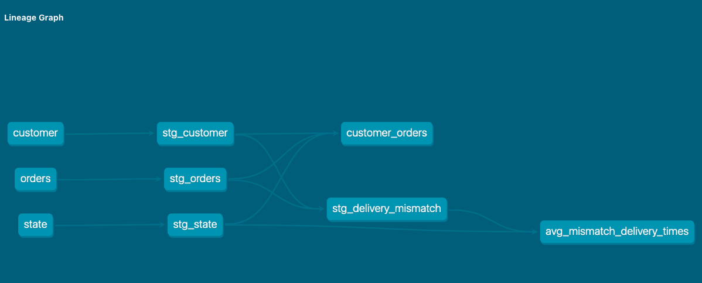

# postgresql and dbt
This is an example repo where I started with a tutorial and a postgresql docker container and worked onwards.

It contains a macro, staging views, and a set of tables
in the 'mart'.



- - - - - - -

Log of actions.
2021-03-15

Following tutorial at https://www.startdataengineering.com/post/dbt-data-build-tool-tutorial/

material [here](https://github.com/josephmachado/simple_dbt_project "github link")


Need pgcli ,tried to install it in the same pyenv virtualenv environment, big failure. Used `brew install pgcli` in stead.

```
docker run --name pg_local -p 5432:5432 \
-e POSTGRES_USER=start_data_engineer -e POSTGRES_PASSWORD=password \
-e POSTGRES_DB=tutorial -d postgres:12.2
```

connect to database with

`pgcli -h localhost -p 5432 -U start_data_engineer tutorial`

deleted directory, created it again with dbt. `dbt init dbt-postgresql`
replaced readme with this file

copied data from git example project to data here.
modified ~/.dbt/profiles.yml with code from example.
modified dbt_project.yml to tutorial example, so that profile matches 'tutorial' profile in ~/.dbt/profile.yml  and materialization by default is set to table, and is overwritten to view for staging.
created all the staging and mart models
ran dbt debug. needed to set the profiles.yml
to ```schema: "`dbt`_tutorial"```
and the project needed a `config-version: 2` entry.
ran `dbt seed` gave a warning that seed had not settings set `Deprecation Warning: The quote_columns parameter was not set for seeds, so the default value of False was chosen. The
default will change to True in a future release.`
seed successful.
dbt run. error in `models/mart/customer_orders.sql`
checking compiled sql (forgat a comma, and set one wrong)
ran it again, worked.
ran dbt test, successful
tried spot check. is not working because the tables has special characters. the `dbt`-part.
tried to modify both profiles.yml and dbt_project. dbt run fails, because I did not put the seeds in yet.
reran dbt seed, dbt run, dbt test.

Extra from tutorial, I created a new staging table that calculates the delivery mismatch times.
And a table that gives min, max and average times for every state.

extracted logic of difftimes into a macro.


stop docker containers
```
docker stop $(docker ps -aq)
docker rm $(docker ps -aq)
```
